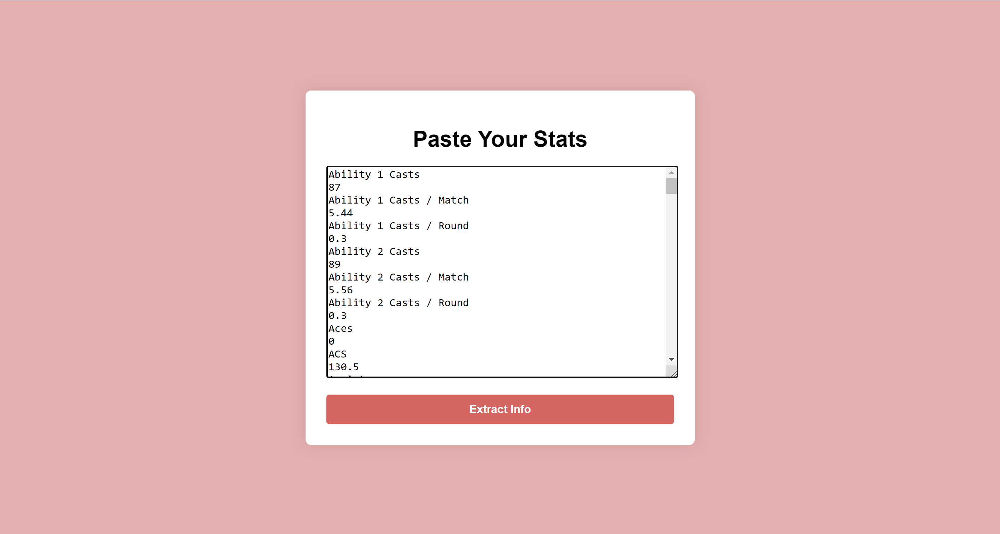
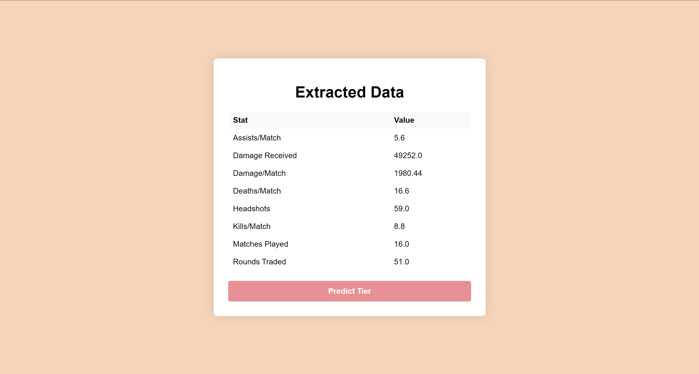
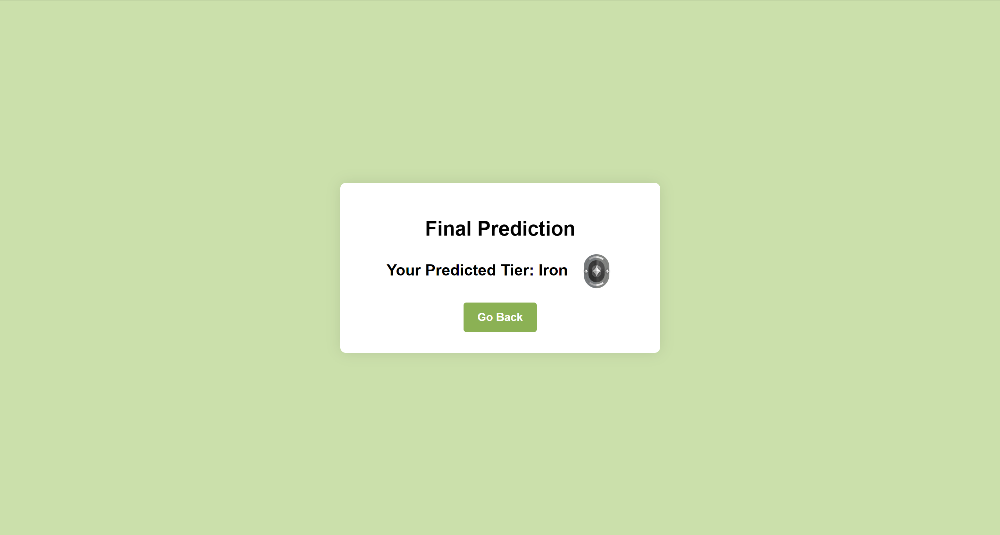

# Valorant Tier Predictor

A simple Flask-based web application that predicts your **Valorant rank** based on in-game statistics. This project leverages a **Logistic Regression model** to provide accurate predictions and includes a clean, user-friendly interface.

---

## ✨ Features

- **Paste Your Stats:** Input raw in-game statistics as text, and the app will extract relevant metrics like Assists per Match, Damage Received, and more.
- **Accurate Predictions:** The app uses a pre-trained **Logistic Regression model** for rank predictions.
- **Visual Results:** Displays your predicted rank alongside a rank-specific icon for better visual clarity.
- **Streamlined Workflow:** Multi-step process for better usability:
  1. Paste your stats.
  2. Extract key metrics.
  3. Predict your rank.

---

## 🚀 Live Demo

Try the app live here:  
[**Valorant Tier Predictor on Render**](https://valorant-rank-prediction.onrender.com)

> ⚠️ **Note:** Free hosting may cause slight delays (up to 50 seconds) for the app to load when inactive.

---

## 🛠️ How to Run Locally

Follow these steps to run the project on your local machine:

### 1. Clone the Repository
```bash
git clone https://github.com/your-username/valorant-tier-predictor.git
cd valorant-tier-predictor
```

### 2. Install Dependencies
Ensure you have Python 3.7+ installed. Install the required dependencies using `pip`:
```bash
pip install -r requirements.txt
```

### 3. Run the App
Start the Flask server:
```bash
python app.py
```

The app will be accessible at **[http://127.0.0.1:5000](http://127.0.0.1:5000)**. The default browser will open automatically.

### 4. Paste Stats and Predict
- Paste your stats from the game into the provided text box.
- Extract the key metrics.
- View your predicted tier with its associated icon.

---

## 🧠 Machine Learning Model

The app uses a **Logistic Regression model**, trained on Valorant player stats, to predict the player's rank. The key features used for predictions include:

- Assists per Match
- Damage Received
- Headshots
- Rounds Traded
- Kills per Match
- Deaths per Match
- Damage per Match
- Kill/Death Ratio (K/D)

The model is pre-trained and saved as a `.pkl` file, which is loaded at runtime for making predictions.

---

## 🖼️ Screenshots

### 1. **Paste Your Stats**


### 2. **Extracted Metrics**


### 3. **Prediction Result**


---

## 📂 Project Structure

```plaintext
valorant-tier-predictor/
├── app.py                   # Main Flask application
├── model.pkl                # Pre-trained Logistic Regression model
├── scaler.pkl               # Scaler for preprocessing input data
├── requirements.txt         # Python dependencies
├── static/
│   ├── images/              # Rank icons and demo images
│   └── styles/              # CSS files (if applicable)
└── templates/
    ├── extract.html         # Step 1: Paste stats
    ├── show_data.html       # Step 2: Extracted metrics
    └── result.html          # Step 3: Predicted rank
```

---

## 🔧 Technologies Used

- **Backend:** Flask
- **Machine Learning:** Logistic Regression (using scikit-learn)
- **Frontend:** HTML5, CSS3
- **Deployment:** Render

---

## 🏗️ Future Improvements

- Add support for other game stats and modes.
- Include additional machine learning models (e.g., Random Forest, XGBoost) for comparison.
- Enhance user experience with improved UI design.
- Add the ability to save and share results.

---

## 🙌 Contributing

Contributions are welcome! Feel free to:
1. Fork the repository.
2. Create a new branch.
3. Submit a pull request.

---
